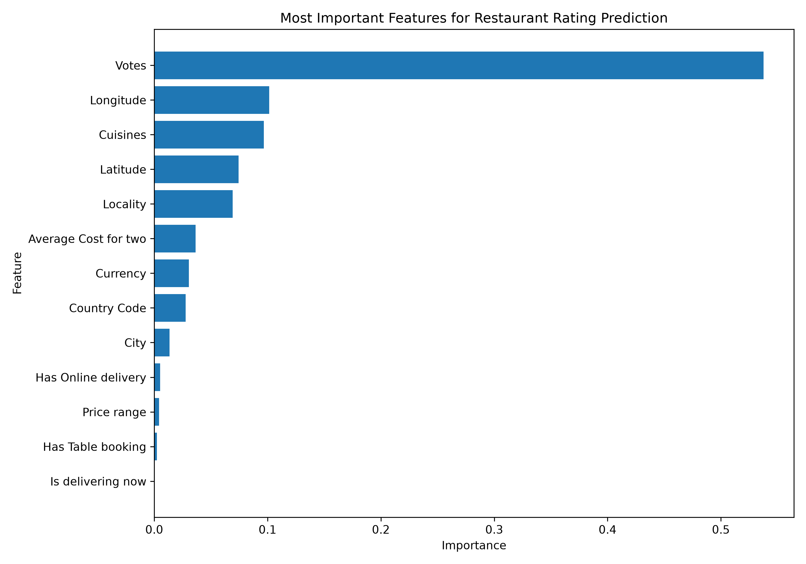

# Restaurant Ratings Prediction

## About the Project

A machine learning project to predict restaurant ratings using information such as votes, location, cuisine, pricing, and restaurant services.

The project compares different regression models and uses feature importance to understand which factors are most useful for predicting ratings.

## Dataset

The dataset contains information about 9,551 restaurants with 21 features.

After cleaning the data and removing restaurants with no rating, 7,403 restaurants were used for modelling.

## What I Did

1. Cleaned the dataset and handled missing values.
2. Removed unnecessary and redundant columns.
3. Split the data into training and testing sets.
4. Used one-hot encoding for categorical features.
5. Trained three regression models:
   - Linear Regression
   - Decision Tree Regression
   - Random Forest Regression
6. Compared the models using MSE, RMSE, and R².
7. Tuned the Random Forest using cross-validation.
8. Analyzed feature importance.

## Model Results

| Model | RMSE | R² |
|---|---:|---:|
| Linear Regression | 0.380 | 0.533 |
| Decision Tree | 0.372 | 0.553 |
| Random Forest | 0.336 | 0.635 |

The tuned Random Forest performed best on the test data.

### Final Random Forest

- Number of trees: 300
- Maximum depth: 15

### Final Test Performance

- MSE: 0.113
- RMSE: 0.336
- R²: 0.635

## Feature Importance

The most important features were:

1. Votes — 53.75%
2. Longitude — 10.14%
3. Cuisines — 9.68%
4. Latitude — 7.45%
5. Locality — 6.92%

The results show that Votes was by far the most influential feature used by the Random Forest.

Feature importance shows which features were useful to the model. It does not mean that these features directly cause higher or lower ratings.

## Files

- `Dataset.csv` - Original dataset
- `cleaned_dataset.csv` - Cleaned dataset
- `data_clean.py` - Data cleaning
- `rating_predict.py` - Linear Regression
- `decision_tree.py` - Decision Tree Regression
- `random_forest.py` - Final Random Forest
- `fine_tuing.py` - Hyperparameter tuning
- `feature_imp.py` - Feature importance analysis
- `feature_importance.png` - Feature importance graph

## Tools Used

- Python
- Pandas
- NumPy
- Scikit-learn
- Matplotlib
